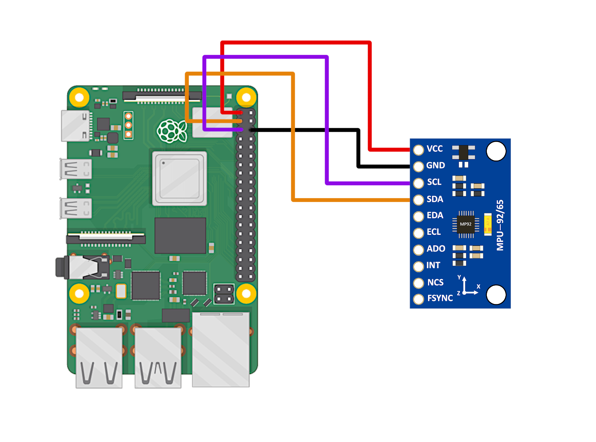

# mpu9250_ahrs

MPU9250 IMU driver with AHRS algoritm

---

## Overview
* Algorithm
  - [x] Madgwick
  - [x] Mahony
  - [x] EKF

* Platform
  - [x] Python
  - [x] C++
  - [] Arduino
  - [] STM32

## Build
```
git clone https://github.com/laitathei/mpu9250_ahrs.git
cd mpu9250_ahrs/cpp/build
cmake ..
make
```

## System Requirement
```
Ubuntu: 20.04/22.04
Python: 3.10.12
ROS: noetic
```

## System Privileges
```
sudo cp 99-i2c.rules /etc/udev/rules.d
sudo udevadm control --reload
sudo reboot
```

## C++ Library installation
<details><summary>[click for detail]</summary>

  + ### Install WiringPi (C++):
    ```
    git clone https://github.com/WiringPi/WiringPi.git
    cd WiringPi
    ./build
    ```

  + ### Install yaml-cpp (C++):
    ```
    git clone https://github.com/jbeder/yaml-cpp
    cd yaml-cpp
    mkdir build
    cd build
    cmake -D BUILD_SHARED_LIBS=ON ..
    make
    sudo make install
    ```
</details>

## Python Library installation
<details><summary>[click for detail]</summary>

    ```
    chmod +x install.sh
    sudo ./install.sh
    pip3 install -r requirements.txt
    ```
</details>

## Wiring diagram
<details><summary>[click for detail]</summary>

  + ### Raspberry Pi 4B:
    
    [Image Source](https://makersportal.com/blog/calibration-of-an-inertial-measurement-unit-with-raspberry-pi)

</details>